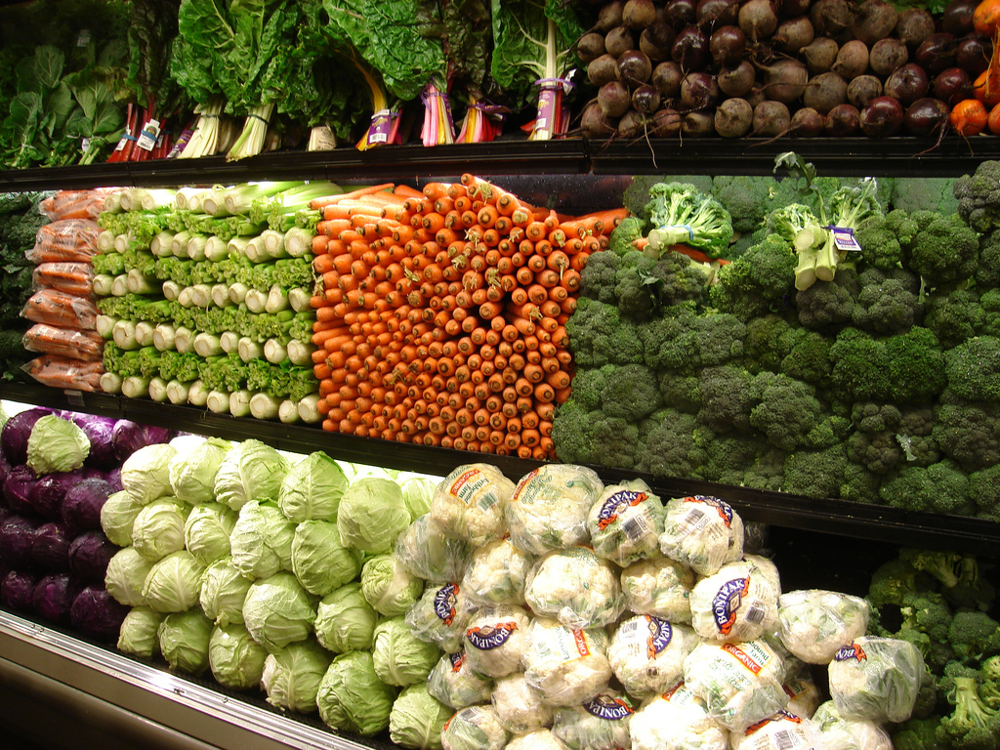
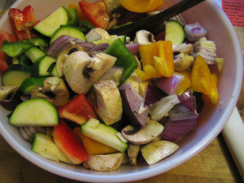
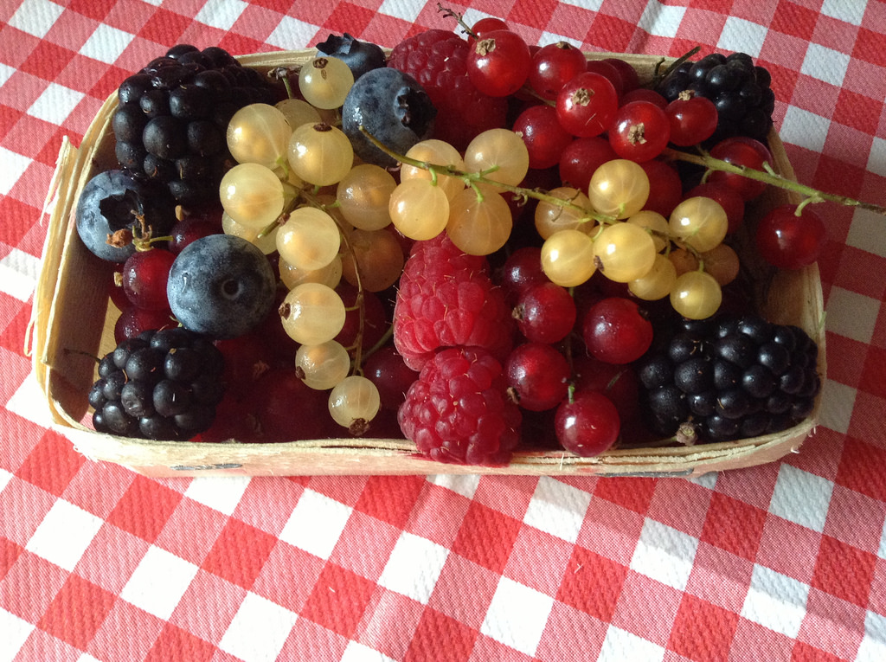
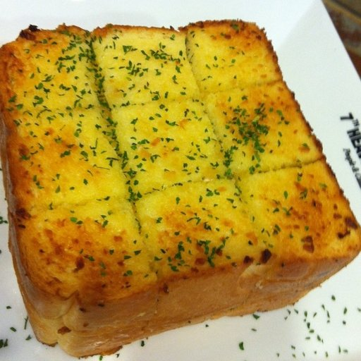
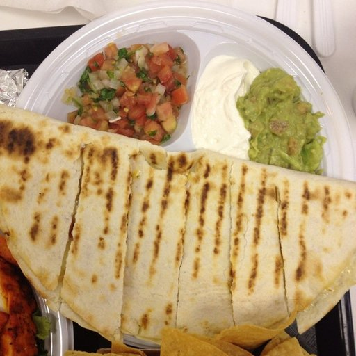
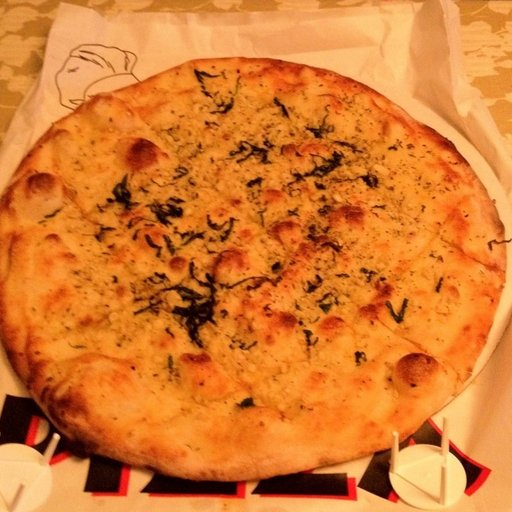
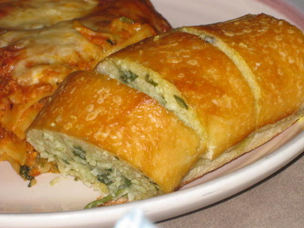
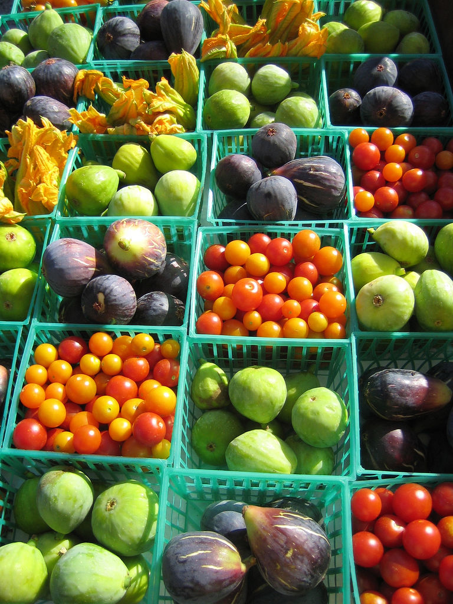
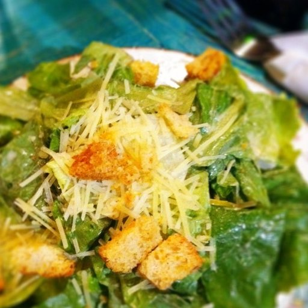
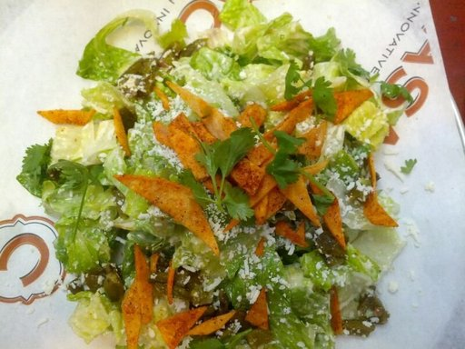

## **Active Learning** 

For saving image labeling costs and lifting your model performance with maximum labeling efficiency.
  
### **Project team**: Praveen Jesudhas, Meenakshi Morla
### **Developers**: Aditya Juvali
### **Status**: under development
 

##### **Implementation:**  Python   **Projects:** Client_X   **Category:** Image Annotation   **Component Link:**  

  
# **Deep Active Learning for Unlabeled data**

Active Learning (AL) is a method for selective labeling of images to trim down labeling costs yet boost trained model accuracy with the most detailed human labeled images.   Deep Learning (DL) offers capabilities to process and learn features from high dimensional data through deep Neural Networks (NN). There are many popular pre-built NN like RESNET50, vgg16, ALEXNET, etc.
  A combination of DL and AL will be a robust and cost saver mechansim to deal with unlabeled data. Here is the architecture of DeepAL -   

 

**Traditionally,**  
Images were selected randomly from the unlabeled data pool for human labeling and then fed to the base trained model, when the goal is always to improve the classification performance. This method would not give significant and consistent lift in performance because the randomly sampled images may not have complex details for incremental learning.  
Example, say our base trained model has learned how to classify all the below images into Vegetables-Fruits and Bread -  

<table>
  <tr>
    <td> </td>
    <td></td>
    <td></td>
   </tr>
   <tr><td></td><td></td><td></td></tr>
   <tr>
      <td></td>
      <td></td>
      <td></td>
   </tr>
</table>

Random sampling may choose images with similar features adding no value to our original model. Example of such images are - 
<table>
  <tr>
    <td> </td>
    <td></td>
   </tr>
</table>

 

**With Active Learning,**  
We want to select those images from the unlabeled sample which are harder for the base train model to classify. Human annotator will label those top N hard images and feed them to the base pre-trained model.  
Example, for the above classifier model we will teach that below images are Vegetables-Fruits and not Bread (since they contain croutons/breadcrums) -  
<table>
  <tr>
    <td> </td>
    <td></td>
   </tr>
</table>

(These images were selected in an experiment by the AL query with entropy sampling strategy on Food image dataset)

 

**Some Active Learning strategies[1],**
1.	<u>Uncertainty Sampling</u>: Selects the least sure instances for labelling. 
>a.	Classifier uncertainty = 1 - P(prediction is correct)

2.	<u>Entropy Sampling</u>: Selects the instances where the class probabilities have the largest entropy. 
>a.	Entropy of the class probabilities. Example, Confusing predictions with higher probabilities for multiple classes will have higher entropy. Predictions with single dominating probability class will have lower entropy.

3.	<u>Margin Sampling</u>: Selects the instances where the difference between the first most likely and second most likely classes are the smallest. 
>a.	Margin uncertainty = the difference of the probabilities of first and second most likely predictions.

 

### **In an Experiment on Food dataset,**
We trained a model using RESNET50 on the Food dataset with 3 categories - Bread, Meat and Vegetables-Fruits with total dataset size of 250 images. First, we applied random sampling on this base model. We used the same original base model to try different AL query strategies to compare the performances of each samping method. Here are the metrics for comparsion -  
 
**Base Model f1 Score = 71%**
<table align="left">
  <tr>
    <td><b>Sampling Method</b></td>
    <td><b>Sample size</b></td>
    <td><b>f1 Score</b></td>
    <td><b>Lift(%)</b></td>
   </tr>
  <tr>
    <td>Random Sampling</td>
    <td>250</td>
    <td>72%</td>
    <td>+1%</td>
   </tr>
   <tr>
    <td>Uncertainty Sampling</td>
    <td>250</td>
    <td>87%</td>
    <td>+16%</td>
   </tr>
   <tr>
    <td>Entropy Sampling</td>
    <td>250</td>
    <td>83%</td>
    <td>+12%</td>
   </tr>
   <tr>
    <td>Margin Sampling</td>
    <td>250</td>
    <td>81%</td>
    <td>+10%</td>
   </tr>
</table>

       

### **References:**
1. modAL : https://modal-python.readthedocs.io/en/latest/content/overview/modAL-in-a-nutshell.html
2. A Survey of Deep Active Learning : https://arxiv.org/pdf/2009.00236.pdf
